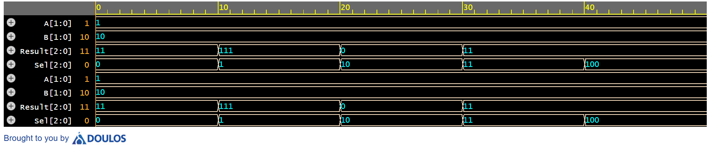

# 2-bit ALU Design in Verilog

This project implements a 2-bit Arithmetic Logic Unit (ALU) using Verilog HDL.

## Operations Implemented
- Addition
- Subtraction
- AND
- OR
- XOR

## Tools Used
- Verilog HDL
- EDA Playground
- EPWave

## Simulation Waveform

## Author
Manoj U K  
Electronics and Communication Engineering
